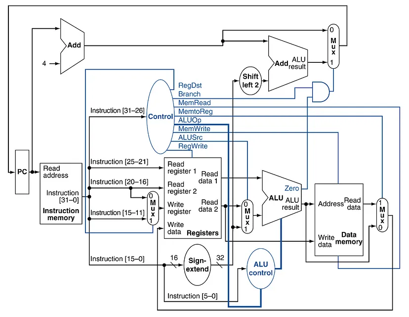

# Single Cycle Datapath (SCDP) - Verilog

## Overview

This repository contains the Verilog code for implementing a Single Cycle Datapath (SCDP) for the RISC-V processor. The design is based on the RISC-V Instruction Set Architecture (ISA) and follows the principles of a single-cycle execution model. The datapath design includes essential components like the ALU, registers, control unit, and memory. 

The implementation aims to demonstrate the interaction between these components during instruction execution in a single clock cycle.

## Articles
I have written a series of articles explaining the design and implementation of the Single Cycle Datapath (SCDP) must read and review it. The following are the links to the articles:

1. [Instruction Set Architecture (ISA) - RISC - Single Cycle Datapath](https://medium.com/@hassu20083/instruction-set-architecture-risc-v-single-cycle-datapath-8277381b87da)  
2. [Hardware Design - RISC-V - Single Cycle Datapath - Part-01](https://medium.com/@hassu20083/hardware-design-risc-v-single-cycle-datapath-part-01-235e9f060733)  
3. [Hardware Design - RISC-V - Single Cycle Datapath - Part-02](https://medium.com/@hassu20083/hardware-design-risc-v-single-cycle-datapath-part-02-3aa48cee4284)
4. [Hardware Design - RISC-V - Single Cycle Datapath - Part-03](https://medium.com/@hassu20083/hardware-design-risc-v-single-cycle-datapath-part-03-b299fb95403d)

## Features

- **Verilog Code**: The main code files contain the Verilog implementation of the Single Cycle Datapath.
- **Control Unit**: Handles control signals for different instruction types.
- **ALU Operations**: Supports a range of arithmetic and logic operations.
- **Memory Operations**: Includes data memory and instruction memory components.
- **Register File**: Supports read/write operations for registers.
- **Datapath Image**: A graphical representation of the Single Cycle Datapath for reference.

## Datapath Diagram

The following diagram illustrates the complete Single Cycle Datapath design:

## Contribution

Feel free to fork this repository, submit issues, and contribute improvements. If you have any questions or suggestions, feel free to open an issue.

## License

This project is open-source and available under the MIT License.
